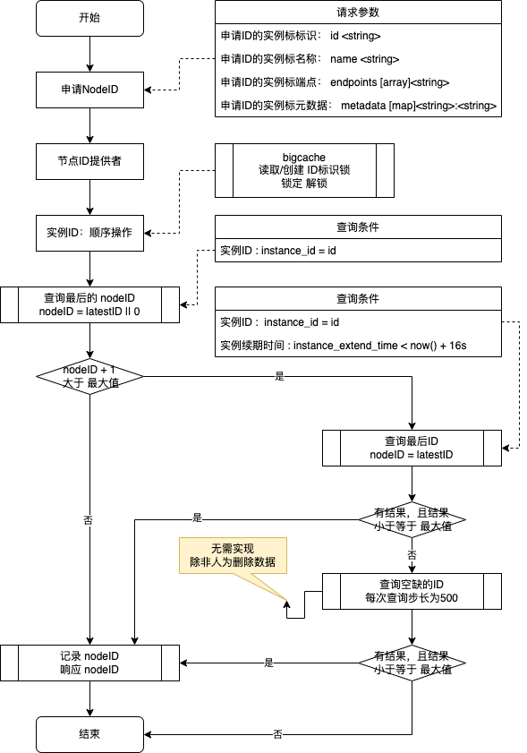

# 雪花算法 节点ID

为`snowflake`雪花算法，提供唯一节点ID(nodeID:节点ID，machineID:机器编码)

当业务服务需要扩容时，节点ID必须全局**唯一**，然后才能生产**唯一ID**

主要功能：提供全局唯一的**节点ID**

## 使用示例

```text

// WorkerRepo ...
type WorkerRepo interface {
	GetNodeId(ctx context.Context, req *apiv1.GetNodeIdReq) (resp *apiv1.SnowflakeWorkerNode, err error)
	ExtendNodeId(ctx context.Context, req *apiv1.ExtendNodeIdReq) (resp *apiv1.Result, err error)
}

// ExampleNewWorker ...
func ExampleNewWorker() {
	var workerHandler WorkerRepo

	conf := &confv1.Data_MySQL{
		Dsn:            "root:Mysql.123456@tcp(127.0.0.1:3306)/srv_snowflake?charset=utf8mb4&timeout=30s&parseTime=True&loc=Local",
		LoggerEnable:   true,
		LoggerColorful: true,
		LoggerLevel:    "DEBUG",
	}
	dbConn, err := NewMysqlDB(conf)
	if err != nil {
		panic(err)
	}
	workerHandler, err = NewWorker(
		WithDBConn(dbConn),
		WithMaxNodeID(5),
		WithIdleDuration(16 * time.Second),
	)
	if err != nil {
		panic(err)
	}
	_, _ = workerHandler.GetNodeId(context.Background(), nil)
	_, _ = workerHandler.ExtendNodeId(context.Background(), nil)
}
```

## 数据存储

数据存储组件：数据库

数据库操作使用了[GORM](https://gorm.io/)，支持一下的数据库：

> 使用示例，请参考：[./node-id/node-id_test.go](node-id/node-id_test.go)

- [x] `MySQL`
- [x] `PostgreSQL`
- [x] `SQLite`
- [x] `SQL Server`

```mysql

-- 创建数据库
CREATE DATABASE `srv_snowflake` DEFAULT CHARSET utf8mb4;
USE `srv_snowflake`;

DROP TABLE IF EXISTS snowflake_worker_node;
CREATE TABLE snowflake_worker_node
(
    id                     BIGINT UNSIGNED AUTO_INCREMENT COMMENT 'id',
    node_uuid              VARCHAR(255) DEFAULT '' NOT NULL COMMENT '唯一ID；instance_id+node_id',
    instance_launch_time   DATETIME(3)             NOT NULL COMMENT '实例启动时间',
    instance_extend_time   DATETIME(3)             NOT NULL COMMENT '实例续期时间',
    instance_id            VARCHAR(255) DEFAULT '' NOT NULL COMMENT '实例ID',
    snowflake_node_id      INT          DEFAULT 0  NOT NULL COMMENT '雪花算法节点id',
    instance_name          VARCHAR(255) DEFAULT '' NOT NULL COMMENT '实例名称',
    instance_endpoint_list JSON                    NOT NULL COMMENT '实例端点数组',
    instance_metadata      JSON COMMENT '实例元数据',
    created_time           DATETIME(3)             NOT NULL COMMENT '创建时间',
    PRIMARY KEY (id),
    UNIQUE KEY node_uuid (node_uuid),
    KEY instance_id (instance_id),
    KEY instance_extend_time (instance_extend_time),
    KEY snowflake_node_id (snowflake_node_id)
) ENGINE InnoDB
  DEFAULT CHARSET utf8mb4
    COMMENT '雪花算法节点ID';

```

## 算法流程图



## 作为服务使用

node-id核心代码所在位置：

- [./node-id](./node-id)
- [./api](./api)

其他的目录为：`kratos`框架服务

服务配置：[./config](./configs)

- 开放接口: `HTTP` : [HTTP] server listening on: [::]:8081
- 开放接口: `GRPC` : [gRPC] server listening on: [::]:9091

### 服务配置

修改配置文件： [./configs/config.yaml](configs/config.yaml)

- 修改数据库配置 : `data.mysql.dsn` : 账户、密码、数据库
- 修改节点ID配置 : `node_id.max_node_id` 最大节点值 与 `node_id.idle_duration` 空闲ID时间

**启动服务**

```shell
go run ./cmd/main/... -conf=./configs
```

**构建服务**

```shell
# 构建服务
go build -o ./bin/snowflake-node-id ./cmd/main/snowflake-node-id.go
go install ./cmd/main/snowflake-node-id.go
# 运行服务
./bin/snowflake-node-id -conf=./configs
snowflake-node-id -conf=./configs
```

**测试服务**

```shell

# ping
curl -k http://127.0.0.1:8081/api/v1/ping/hello

# get node id
curl -k -X POST \
    -H "Content-Type:application/json" \
    -d '{"instanceId":"test-service"}' \
    http://127.0.0.1:8081/api/v1/node-id/get-node-id
    
# extend node id
curl -k -X POST \
    -H "Content-Type:application/json" \
    -d '{"id":100,"instanceId":"test-service","nodeId":10}' \
    http://127.0.0.1:8081/api/v1/node-id/extend-node-id
```

**响应**

> 如果响应结果是JSON，则`uint64、int64` 自动转换为 `string`

```json
{
  "code": 0,
  "reason": "",
  "message": "",
  "requestId": "cc8r18lvqc7qhsr8nsk0",
  "data": {
    "@type": "type.googleapis.com/node.id.api.apiv1.SnowflakeWorkerNode",
    "id": "8",
    "instanceExtendTime": "2022-09-02 15:28:34",
    "instanceId": "test-service",
    "nodeId": "1",
    "instanceName": "",
    "instanceEndpointList": "[]",
    "instanceMetadata": "{}"
  },
  "metadata": {}
}
```
